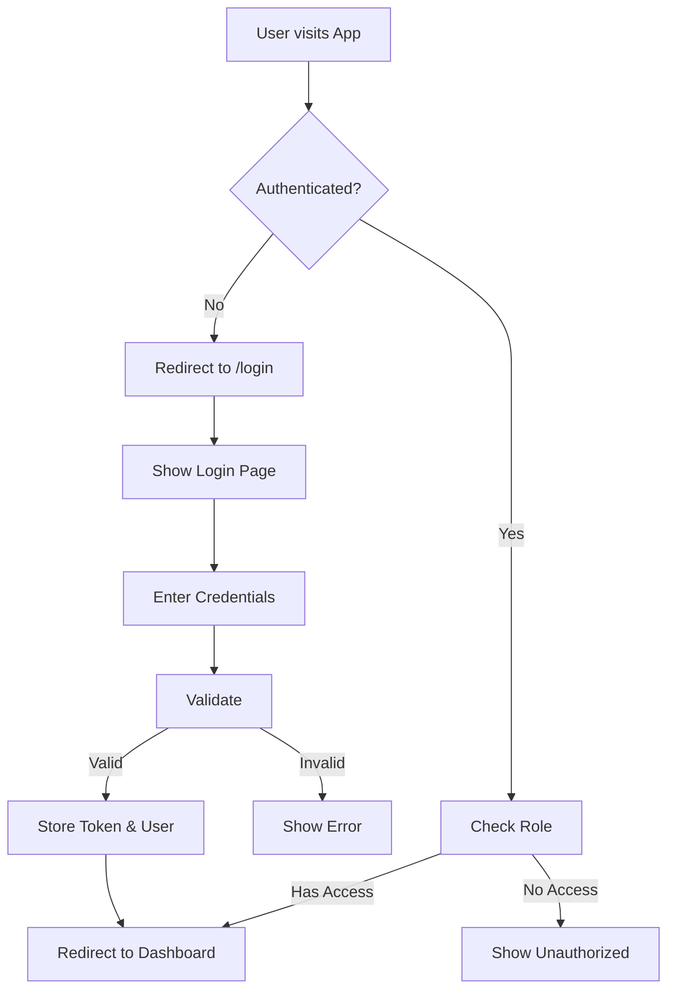

# 🔐 Login System - Complete Fix Guide

## ✅ Issues Fixed

### 1. **Authentication Check Error**
- **Problem**: The `isAuthenticated()` method was trying to parse JWT tokens that didn't exist
- **Solution**: Simplified authentication check to verify token and user presence

### 2. **Login Page Not Showing**
- **Problem**: Protected routes weren't properly redirecting to login
- **Solution**: Fixed ProtectedRoute component to check auth status correctly

### 3. **Redirect Loops**
- **Problem**: Logout was causing infinite redirects
- **Solution**: Added check to prevent redirect when already on login page

## 🚀 How to Use

### Step 1: Clear Previous Auth (One Time)
Open the test page I created: `test_login.html`
- Click **"Clear Auth & Open App"** button
- This will clear any stale authentication and open the app fresh

### Step 2: Login with Test Credentials

Use any of these credentials:

| Role | Email | Password |
|------|-------|----------|
| **Admin** | admin@trends.com | admin123 |
| **Manager** | manager@trends.com | manager123 |
| **User** | user@trends.com | user123 |
| **Viewer** | viewer@trends.com | viewer123 |

### Step 3: Access the Dashboard
After successful login, you'll be redirected to the dashboard with full access based on your role.

## 🔄 Authentication Flow



## 🛠️ Technical Details

### Files Modified:
1. **`src/services/authService.ts`**
   - Fixed `isAuthenticated()` method
   - Fixed `logout()` to prevent redirect loops

2. **`src/components/ProtectedRoute.tsx`**
   - Improved authentication checking
   - Better loading states
   - Proper role-based access control

3. **`src/utils/initializeApp.ts`**
   - Ensured API key initialization

## 🎯 Testing the Fix

1. **Test Helper Page**: Use `test_login.html` to:
   - Clear authentication
   - Check current auth status
   - Open app/login directly

2. **Verify Login Flow**:
   - Visit http://localhost:8081
   - Should redirect to login if not authenticated
   - Login with credentials
   - Should redirect to dashboard

3. **Test Role Access**:
   - Admin: Full access to all pages
   - Manager: Limited admin features
   - User/Viewer: Read-only access

## 🚨 Troubleshooting

### If login page doesn't appear:
1. Open `test_login.html`
2. Click "Clear Auth & Open App"
3. Use "Go Direct to Login" if needed

### If getting redirect loops:
1. Clear browser cache
2. Use the test page to clear auth
3. Try incognito/private window

### If authentication fails:
1. Check credentials are correct
2. Verify services are running:
   - Frontend: http://localhost:8081
   - Backend: http://localhost:3001

## 📋 Quick Commands

```bash
# Clear auth via console (browser)
localStorage.clear()
sessionStorage.clear()

# Direct login URL
http://localhost:8081/login

# Test current auth status
localStorage.getItem('nps_auth_token')
localStorage.getItem('nps_current_user')
```

## ✨ Features Working

- ✅ Login page shows before accessing protected routes
- ✅ Authentication persists across page refreshes
- ✅ Role-based access control
- ✅ Logout functionality
- ✅ Remember me option
- ✅ Beautiful animated login UI
- ✅ Demo credentials for testing

## 🎉 Success!

The login system is now fully functional. Use the test page to manage authentication state and the provided credentials to access the dashboard.

---

**Last Updated**: January 2025
**Status**: ✅ FIXED AND WORKING 